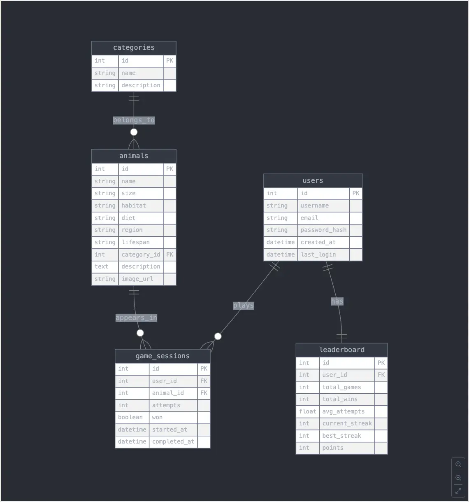

# INFO
We will be using `sail` for Laravel's _Dockerization_.  Read the documentation at:
> https://laravel.com/docs/11.x/sail

## Install `sail`
```shell
composer require laravel/sail --dev
```

## Copy the environment
```shell
cp .env.example .env.local
```

## Then configure a shell `alias`
```shell
alias sail='sh $([ -f sail ] && echo sail || echo vendor/bin/sail)'
```
To make it permanent add above line to your `.zshrc` or `.bashrc` and source it:
```shell
nano ~/.zshrc
# paste the alias command and save the file
source ~/.zshrc
```


else you will have to call `sail` with relative path:
```shell
# without alias
./vendor/bin/sail

# with alias
sail
```

## RUN
To start all of the Docker containers defined in your application's `docker-compose.yml` file, you should execute the `up` command:
```shell
# You may run your Docker containers using Sail's "up" command.  
sail up
```
To start all of the Docker containers in the background, you may start Sail in "detached" mode:
```shell
sail up -d
```
Once the application's containers have been started, you may access the project in your web browser at: http://localhost.

```shell
# Run "artisan migrate" to run database migrations:  
sail artisan migrate
```

then

### Install `breeze` 
- in order to use `interia` and `vue.js`
```shell
./vendor/bin/sail composer require laravel/breeze --dev

sail artisan migrate
npm install
npm run dev
```
## Quick run (for development)
```shell
sail up -d
npm run dev
```

# Executing Commands

When using Laravel Sail, your application is executing within a Docker container and is isolated from your local computer. However, Sail provides a convenient way to run various commands against your application such as arbitrary PHP commands, Artisan commands, Composer commands, and Node / NPM commands.

When reading the Laravel documentation, you will often see references to Composer, Artisan, and Node / NPM commands that do not reference Sail. Those examples assume that these tools are installed on your local computer. If you are using Sail for your local Laravel development environment, you should execute those commands using Sail:

```shell
# Running Artisan commands locally...
php artisan queue:work

# Running Artisan commands within Laravel Sail...
sail artisan queue:work
```
For more info read:
> https://laravel.com/docs/11.x/sail#executing-sail-commands

# ER Diagram


